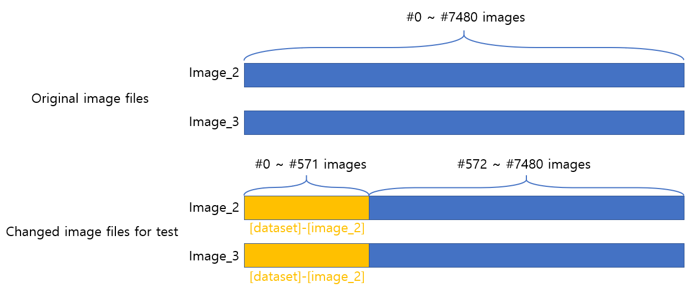

# Improved(Ours. Especially RPN changed) Stereo R-CNN

**Authors:** Team32
Ji-il Park(20195355), Hyunyong Jeon(20193813), Leon Thormeyer(20196530)

## 0. Install

This implementation is tested under Pytorch 1.0.0. 
To avoid affecting your Pytorch version, we recommend using conda to enable multiple versions of Pytorch.

0.0. Install Pytorch:
```
    conda create -n env_stereo python=3.6
    conda activate env_stereo
    conda install pytorch=1.0.0 cuda90 -c pytorch
    conda install torchvision -c pytorch
```
0.1. Other dependencies:
```
    git clone https://github.com/hyunyongjeon/repo.git
    cd stereo_rcnn
    git checkout 1.0
    pip install -r requirements.txt
```
0.2. Build:
```
    cd lib
    python setup.py build develop
    cd ..
```

## 1. Quick Demo

1.0. Just run

```
    python demo.py
```

If everything goes well, you will see the detection result on the left, right and bird's eye view image respectively.

## 2. Dataset Preparation

2.0. Download the left image, right image, calibration, labels and point clouds (optional for visualization) from [KITTI Object Benchmark](http://www.cvlibs.net/datasets/kitti/eval_object.php?obj_benchmark=3d). Make sure the structure looks like:
```
yourfolder/object
              training
                image_2
                image_3
                label_2
                calib
                velodyne
```
2.1. Create symlinks:
```
    cd data/kitti
    ln -s yourfolder/object object
    cd ../..
```
## 3. Test(Original algorithm)

You can evaluate the 3D detection performance using either our provided model or your trained model. 
Set corresponding CUDA_VISIBLE_DEVICES in test.sh, and run
```
    ./test.sh
```
## 4. Test(Ours)
Chande the file(generate anchors.py)
from [Stereo-RCNN-1.0]-[lib]-[model]-[rpn]-[generate_anchors.py]
to 'generate_anchors.py' that is placed in our root folder
Because we change RPNs.


Change the dataset



```
yourfolder/object
              training
                image_2
                image_3
                label_2
                calib
                velodyne
```
You can test the 3D detection performance. 
Set corresponding CUDA_VISIBLE_DEVICES in test.sh, and run
```
    ./test.sh
```

